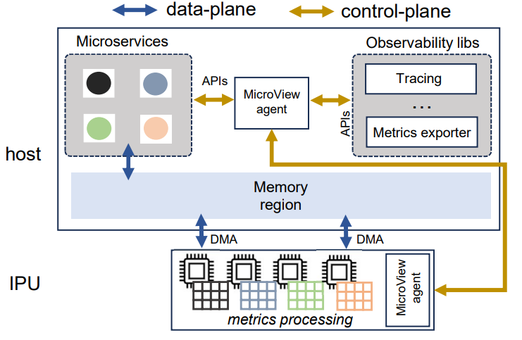

MicroView Control Plane
======================

An implementation SmartNIC-to-host communication via RDMA for microservices metrics.

The description of the project can be found in our published research paper:

[MicroView: Cloud-Native Observability with Temporal Precision](https://dl.acm.org/doi/10.1145/3630202.3630233), ACM CONeXT-SW '23  
*Alessandro Cornacchia, Theophilus A. Benson, Muhammad Bilal, and Marco Canini*

<div align="center">

</div>
<p></p>

## Run instructions
Start agent on localhost running:
```
make
./agent
```

This will start microview agent at port 12345. Then run the following replacing `SERVER_ADDR` with the MicroView 
agent address. If MicroView runs on node use `host.docker.internal`:
```
docker run --rm --name pod --ipc=host --add-host=host.docker.internal:host-gateway acornacchia/ipc "./pod" "SERVER_ADDR"
```

The container should:
1. Open a TCP connection to the agent and ask for a shared memory segment
2. Start writing metrics to such a memory segment

On the other hand, MicroView agent:
1. allocates shared memory region and closes TCP connection
2. sends RDMA `R_key` to the microview agent counter part which sits on the SmartNIC

## Python prototype run instructions

### Test RDMA READ Pyverb
First test a simple client/server Pyverbs example:
```
python rdma/rdma_server.py
```
On another terminal:
```
python rdma/rdma_client.py --host 10.200.0.28 --port 7471
```

### Test RDMA Collector class

```
python rdma/rdma_passive.py
```

Then start test reading metrics:

```
python rdma/test_rdma_connection.py --host 10.200.0.28 --port 18515
```

## TODO list
- Shared memory should be one large block, where RDMA memory regions are 4KB size and contiguous (done)
- How to handle close(). MicroView client should probably close nothing: shared memmory is managed by the uView agent
and deleting metrics make little sense (when pod disappear, it's page will just be released entirely)
- Metrics have now fixed structure (only floating point support), this can be changed with a more flexible memory layout
- log management 
- now you have some high level description of the code in the `.md` file, use that for next iterations (either here or in perplexity)
- Is it normal I can go in RTS with a queue pair that is not associated to any user space code ?

## RDMA in Linux: primer

To list the available Channel Adapters (CA) and RDMA physical ports:
```
$> ibstat
CA 'mlx5_0'
        CA type: MT4129
        Number of ports: 1
        Firmware version: 28.42.1000
        Hardware version: 0
        Node GUID: 0x946dae030038817e
        System image GUID: 0x946dae030038817e
        Port 1:
                State: Down
                Physical state: Disabled
                Rate: 40
                Base lid: 0
                LMC: 0
                SM lid: 0
                Capability mask: 0x00010000
                Port GUID: 0x966daefffe38817e
                Link layer: Ethernet
..
```

### Netdev name to ibdev name
```
(uview) cornaca@mcnode28:[microview-cp]$ ibdev2netdev | grep ens1f1
mlx5_1 port 1 ==> ens1f1 (Up)
```

### Check the available GIDS to connect queue pairs
Pick the one with RoCEv2 and associated to the interface you want:

```
(uview) (base) cornaca@mcnode28:[microview-cp]$ show_gids 
DEV     PORT    INDEX   GID                                     IPv4            VER     DEV
---     ----    -----   ---                                     ------------    ---     ---
mlx5_0  1       0       fe80:0000:0000:0000:966d:aeff:fe38:817e                 v1      ens1f0
mlx5_0  1       1       fe80:0000:0000:0000:966d:aeff:fe38:817e                 v2      ens1f0
mlx5_1  1       0       fe80:0000:0000:0000:966d:aeff:fe38:817f                 v1      ens1f1
mlx5_1  1       1       fe80:0000:0000:0000:966d:aeff:fe38:817f                 v2      ens1f1
mlx5_1  1       2       0000:0000:0000:0000:0000:ffff:0ac8:001c 10.200.0.28     v1      ens1f1
mlx5_1  1       3       0000:0000:0000:0000:0000:ffff:0ac8:001c 10.200.0.28     v2      ens1f1
mlx5_2  1       0       fe80:0000:0000:0000:bace:f6ff:fe4d:cb1c                 v1      ens2f0
mlx5_2  1       1       fe80:0000:0000:0000:bace:f6ff:fe4d:cb1c                 v2      ens2f0
mlx5_2  1       2       0000:0000:0000:0000:0000:ffff:0ac8:0034 10.200.0.52     v1      ens2f0
mlx5_2  1       3       0000:0000:0000:0000:0000:ffff:0ac8:0034 10.200.0.52     v2      ens2f0
mlx5_3  1       0       fe80:0000:0000:0000:bace:f6ff:fe4d:cb1d                 v1      ens2f1
mlx5_3  1       1       fe80:0000:0000:0000:bace:f6ff:fe4d:cb1d                 v2      ens2f1
mlx5_4  1       0       fe80:0000:0000:0000:0ac0:ebff:fe15:3620                 v1      enp65s0f0np0
mlx5_4  1       1       fe80:0000:0000:0000:0ac0:ebff:fe15:3620                 v2      enp65s0f0np0
mlx5_5  1       0       fe80:0000:0000:0000:0ac0:ebff:fe15:3621                 v1      enp65s0f1np1
mlx5_5  1       1       fe80:0000:0000:0000:0ac0:ebff:fe15:3621                 v2      enp65s0f1np1
```